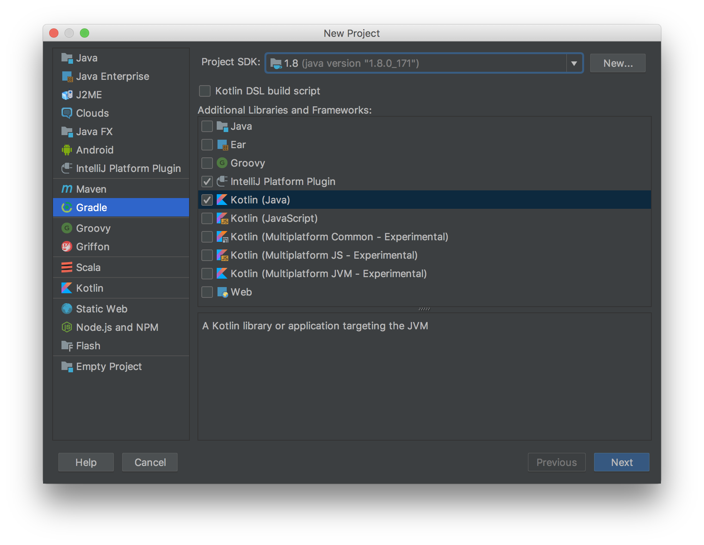

# Can I Put a Web in it?

**or... "Towards a Happy HTML Future"**

## Cutting to The Code

The first step was to create a project.  The only _officially_ supported build
tools for plugin projects are Gradle and IntelliJ IDEA... Given that I needed this
to build in our CI/CD environment this forced my hand; Gradle it was!

Fortunately, as an officially suported setup, we get IDE support.  The "New Project"
dialog offers everything needed to create a perfectly servicable basic plugin project
using both Kotlin and Gradle.




## The WebPane

Next up, there's a bridge to be crossed

For all that WebKit HTML goodness, we need a `WebView`, which comes to us from JavaFX

IntelliJ's UI is, however, based on Swing.  Fortunately a bridge has already been built
for us in the form of `JFXPanel`.  We just need to be aware that the two systems have
their own distinct solutions for worker threads.

First, we need to declare that we'll be exposing a window in `plugin.xml`

```xml
    <extensions defaultExtensionNs="com.intellij">
        <toolWindow id="Snyk" secondary="true" icon="/icons/plus.png" anchor="right" factoryClass="io.snyk.plugin.ui.SnykToolWindow"/>
    </extensions>
```

And then implement the thing.  My first draft went something like this:

```kotlin
class SnykToolWindow : ToolWindowFactory {

    private var jfxPanel: JFXPanel? = null
    private var browser: WebView? = null

    private fun initBrowser(panel: JFXPanel): CompletableFuture<WebView> {
        val ret = CompletableFuture<WebView>()

        // workaround for https://bugs.openjdk.java.net/browse/JDK-8090517
        PlatformImpl.setImplicitExit(false)
        
        // runLater because this bit needs to happen on the JavaFX (not Swing)
        // UI worker thread
        PlatformImpl.runLater{
            val browser = WebView()
            val scene = Scene(browser, Color.ALICEBLUE)
            panel.scene = scene
            ret.complete(browser)
        }
        return ret
    }
    
    private fun loadContent(browser: WebView, project: Project) {
        PlatformImpl.runLater {
            val webEngine = browser.engine
            val content: String = ...
            webEngine.loadContent(content)
        }
    }
    
    override fun createToolWindowContent(project: Project, toolWindow: ToolWindow) {
        jfxPanel = JFXPanel()
        // Take advantage of Java 8's `CompletableFuture` to safely wait for
        // initialisation to complete
        // (given that it happens on a different thread)
        browser = initBrowser(jfxPanel!!).join()
        loadContent(browser!!, project)
        toolWindow.component.parent.add(jfxPanel)
    }
}
```

I personally **HATE** this tactic of constructing an object _then_ initialising it in
a subsequent call.  It stops you flagging members as final (which prevents a number of JVM
optimisations) and it leaves a bunch of `null`s hanging around between the two calls.
As we're in a multi-threaded scenario this risks race conditions and deadlocks,
which is never a fun place to be - hence the `CompleteableFuture`

> After a few years of working on highly-performing massively concurrent code
in Scala, this sort of thing makes me feel really, _really_, uncomfortable.
It runs completely counter to core principles of functional programming; where you
work with immutable data and pure functions.  

But still... it's short, it works, and it gave me something to build on and improve in
subsequent iterations.  I was especially happy to discover that I could set the content of the ToolWindow with the simple 1-line expression `toolWindow.component.parent.add(<<content>>)`

Little was I to know that I'd soon be taken so much further out
of my comfort zone.

## Content is KING

Having a working `WebView` and the contained `WebEngine` is a start, but it's also not
much use unless it's populated!

To do that, there are two ways to get content into a `WebEngine`

1. Call `loadContent` with an HTML String
2. Call `load` with a URL

Given that I was using assets liberated from our website, I knew I'd need
to be able to handle links to CSS files, JS files, etc.  So `loadContent` might be fine
for the initial content, but I'd have work with URLs at some point.

I also knew that I'd need some form of template engine to inject content into templates before displaying them.

This... was fine.  My reasoning was that if a language/framework/platform author
chose to offer a way to embed a web engine into their desktop app framework,
then **of course** they'd offer a way to intercept URLs and provide custom content.

After all, what's the point of embedding if you're limited to only showing what a
regular browser could show anyway?  It would only be useful if you implemented
a web server as well, which would be overkill, and risks expoxing ports to the
outside world.

The JavaFX WebEngine does **not** have such a mechanism.  At least, not directly.
Instead it makes use of Java's existing mechanism for custom URLs, a mechanism that
dates back to version 1.0 when the language was still being targeted for use in small
apps on set top boxes.

However nervous this description makes you sound, the reality turns out to be even worse.

## Gotta Get Yourself Connected

At the heart of Java's custom protocol handling is the `URLStreamHandler` interface, which has one method:

`openConnection(url: URL): URLConnection`

_(Yes, I'm using the Kotlin/Scala convention for type signatures here,
I'm not writing the plugin in Java)_
   
So I "just" needed to implement custom handler for the `snykplugin://` protocol,
and somehow register it for URLs to be directed to the handler as necessary.

In the handler then:

- For classpath resources, I return `classLoader.getResource(<<path>>).openConnection()`
  No problem!

- For templated resources (using ThymeLeaf), I had to implement my own `URLConnection`,
  which was simple enough after losing nearly a full day by mistakenly inheriting
  `sun.net.www.URLConnection` instead of `java.net.URLConnection`.  I may have uttered
  a few choice words on discovering this particular name clash.
  
  _(note: Templating implementation is out-of-scope for these articles, it's not
  strictly related to plugin development)_
  
So far, so good.  The pain (agony more like...) was in persuading Java to actually **use** the handler factory.  Recall here that the mechanisms provided date back
to 1.0, they're older than `java.util.Calendar` which is high quality by comparison.

## Take 1

We have two options available to us.  The first (which seemed the more sane choice)
is to append the fully-quallified package name (e.g. `my.root.synkplugin`) to the
system property `java.protocol.handler.pkgs`.

For this to work, the handler **must** be implemented as a class named "Handler", and **must** have a parent package of the same name as the custom protocol - so `snykplugin`
is both the package name and the protocol name.

Other than the eyebrow-raising naming requirements, this didn't seem too hard.
Something like `System.setProperty("java.protocol.handler.pkgs", "my.root.synkplugin")`
should work, just add the logic to test for pre-existing values and append with a `|` separator.  Problem solved!


**EXCEPT, IT WASN'T**

This didn't work, because plugins are sandboxed via a dedicated ClassLoader, and this interferes with the mechanism.  The default `URL` implementation exists in the root classloader, so when it picks up the property it's then unable to locate the specified package which exists in a nested class loader.

If done for security reasons then this would be laudable, but then why was a more secure alternative not provided, and why was the second (and even less secure) mechanism for injecting a custom handler not also blocked?

## Take 2

Which leads us to the second mechanism.  Call `URL.setURLStreamHandlerFactory` supplying
a custom `URLStreamHandlerFactory` as an argument, where the factory also has a single method:

`createURLStreamHandler(protocol: String) : URLStreamHandler`

The technique can only be used **once per virtual machine**, subsequent calls
to `setURLStreamHandlerFactory` will throw an exception - which means that it could conflict with other plugins, it would fail if I reloaded the plugin... and there's no way to test if a custom handler has been previously installed without using reflection (short of trying, and catching the exception).

> Okay, so I honestly never expected this to work.  I was sure there'd be a conflict, or that it would be blocked for security reasons; after all, the technique can potentially override **all** URL resolution across the entire JVM at the root classloader level, including the internal loading of classes.  But amazingly enough it succeed!

This is not an approach that I would **ever** want to use in production code without first
exploring every other possibility, it's just too risky.  But from the perspective of someone
working for a security company it's still interesting - and a little scary - to find that
it works at all.
   
   
## What Goes Down...

I understand that a sandboxed plugin environment isn't a scenario the original authors
of Java had ever considered, I don't blame them for the 1.0 implementation of custom
protocol handling.
 
I *would* like to call out some ways this could have been subsequently improved though.

The authors of JavaFX certainly should have been aware of the issue
the issue.  The [ProtocolService](https://jxbrowser.support.teamdev.com/support/solutions/articles/9000107014-custom-protocol-handler)
facility of JxBrowser provides a good example of how it can be done so much better.

IntelliJ could also have installed their own centralised factory via
`URL.setURLStreamHandlerFactory`
and provided plugin authors with a far better way to register handlers.  As a bonus,
this would also block a potential security hole.

Alas... This was not to be.  I had to find another way.

## ...Must Go Up

No choice for it.  I had tried to do the sensible, lightweight, thing,
but had been foiled by the technical realities of a 23 year old API.

Bullet, meet teeth, you're about to get bitten.

My only choice now was to run a fully-fledged webserver, using TCP as a means to
bypass the idiosynchracies of the Java API. To do this I used [nanohttpd](http://nanohttpd.org/) - a tiny web server, with no transitive dependencies, designed specifically for embedding.  So small that I even had to implement my map to provide MIME support for the
tiny handful of file extensions that I'd be dealing with.

After adding the server to my build file, I implemented a small class to spin it up
and migrated all the logic for the ThymeLeaf templating and serving of resoures from the
classpath.  Including the MIME-lookup table, the whole thing came in at under 200 lines.

It worked as expected first try, and with less effort than implementing a custom
protocol handler.  I was evem comfortable opening a port like this - it was only
bound to localhost, and might come in useful later for debugging via a browser.

The whole project had also undergone another massive change by this point, but that's a subject for the [next article](Phase_3.md)
 


 


