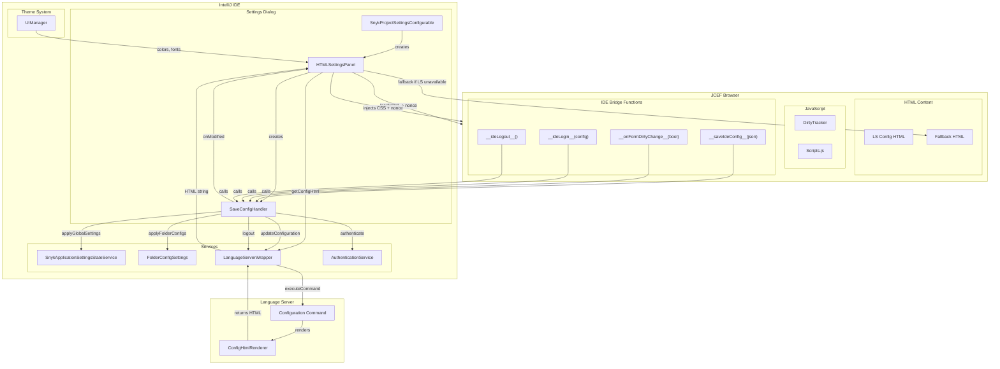
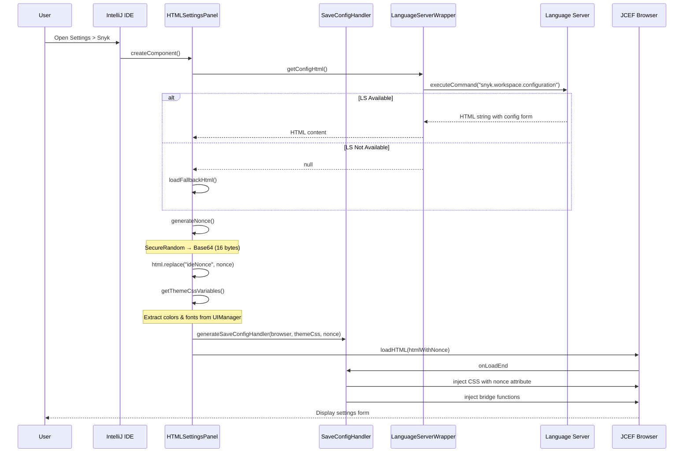
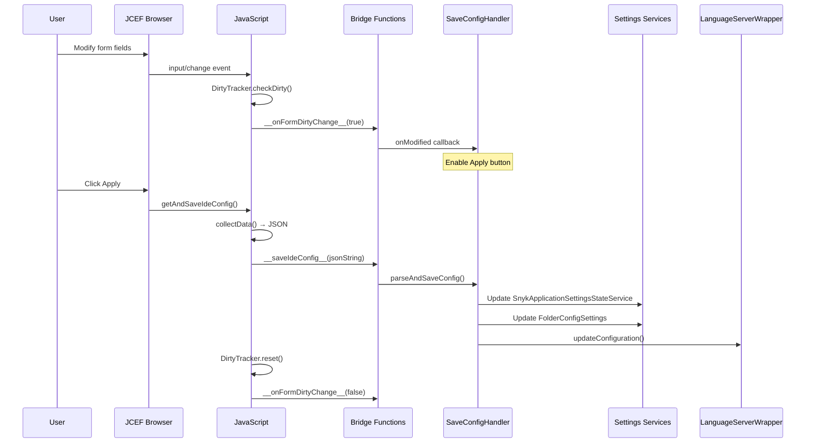
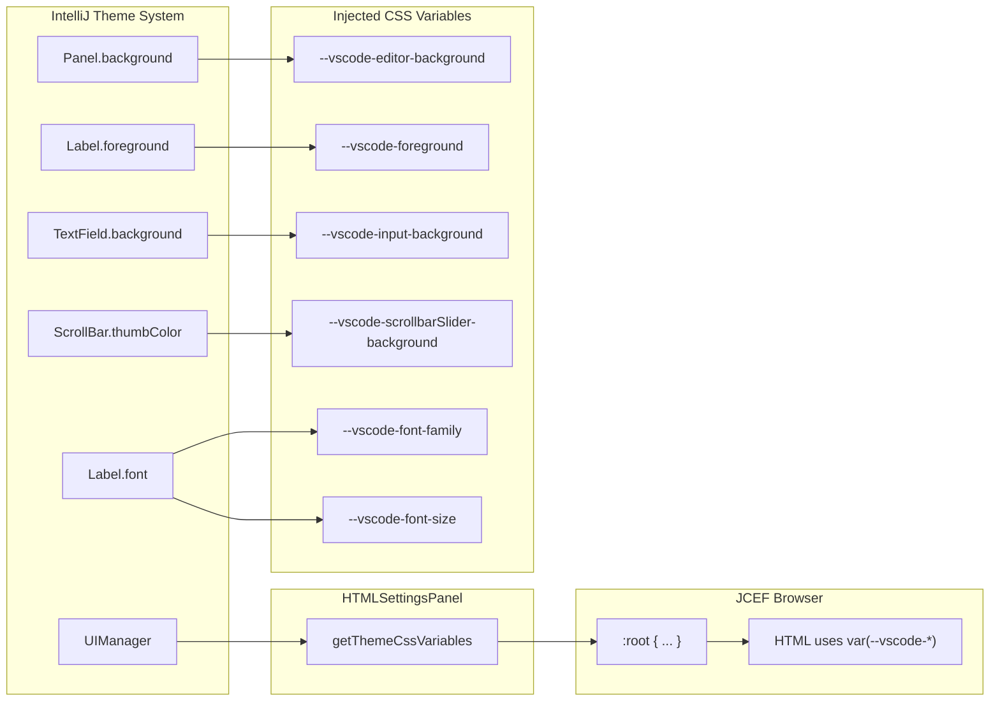

# HTML Settings Panel Architecture

This document describes the architecture of the HTML-based settings panel, including the interaction between the IntelliJ IDE, Language Server, and JCEF browser.

## Overview



## Sequence: Loading Settings Panel



## Sequence: Saving Configuration



## Sequence: Authentication Flow


## Theme Integration



## Bridge Functions Reference

### IDE-Injected Functions (JS → IDE)

| Function | Purpose | Handler |
|----------|---------|---------|
| `__saveIdeConfig__(json)` | Save configuration JSON to IDE settings | `SaveConfigHandler.parseAndSaveConfig()` |
| `__onFormDirtyChange__(isDirty)` | Notify IDE of form dirty state changes | `SaveConfigHandler` → `onModified()` |
| `__ideLogin__(configJson)` | Trigger authentication (saves config first) | `SaveConfigHandler` → `AuthenticationService` |
| `__ideLogout__()` | Trigger logout | `SaveConfigHandler` → `LanguageServerWrapper.logout()` |

### LS-Provided Functions (IDE → JS)

| Function | Purpose | Called By |
|----------|---------|-----------|
| `getAndSaveIdeConfig()` | Collect form data and trigger save | `HTMLSettingsPanel.apply()` |
| `__isFormDirty__()` | Query current dirty state | (available for IDE use) |
| `__resetDirtyState__()` | Reset dirty tracker | (available for IDE use) |

### Fallback HTML Functions

| Function | Purpose |
|----------|---------|
| `saveConfig()` | Collect form data and call `__saveIdeConfig__` |

## Content Security Policy (CSP) & Nonce

The LS HTML includes a Content Security Policy that requires nonces for inline styles:

```html
<meta http-equiv="Content-Security-Policy"
    content="style-src 'self' 'nonce-{{.Nonce}}' https://cdn.jsdelivr.net; ..." />
```

### Nonce Flow

1. **LS renders HTML** with placeholder `nonce="ideNonce"`
2. **HTMLSettingsPanel.generateNonce()** creates secure random nonce (Base64, 16 bytes)
3. **Replace placeholder**: `html.replace("ideNonce", actualNonce)`
4. **Pass to SaveConfigHandler**: `generateSaveConfigHandler(browser, themeCss, nonce)`
5. **Inject CSS with nonce**: `style.setAttribute('nonce', nonce)`

This allows the IDE to inject theme CSS while respecting the LS's security policy.

## CSS Variables Mapping

| CSS Variable | UIManager Key | Fallback |
|--------------|---------------|----------|
| `--vscode-font-family` | `Label.font.family` | `Inter, system-ui` |
| `--vscode-font-size` | `Label.font.size` | `13px` |
| `--vscode-editor-background` | `Panel.background` | `#1e1e1e` |
| `--vscode-foreground` | `Label.foreground` | `#cccccc` |
| `--vscode-input-background` | `TextField.background` | `#3c3c3c` |
| `--vscode-input-foreground` | `TextField.foreground` | `#cccccc` |
| `--vscode-input-border` | `Component.borderColor` | `#454545` |
| `--vscode-button-background` | `Button.default.startBackground` | `#0e639c` |
| `--vscode-focusBorder` | `Component.focusColor` | `#007acc` |
| `--vscode-scrollbarSlider-background` | `ScrollBar.thumbColor` | `#424242` |

## File Structure

```
src/main/kotlin/io/snyk/plugin/
├── ui/
│   ├── settings/
│   │   └── HTMLSettingsPanel.kt      # Main panel, theme injection, nonce generation
│   └── jcef/
│       └── SaveConfigHandler.kt      # Bridge functions, config parsing, CSP-aware CSS injection
├── settings/
│   └── SnykProjectSettingsConfigurable.kt  # Settings entry point (switches old/new dialog)
└── services/
    └── SnykApplicationSettingsStateService.kt  # Global settings storage

src/main/kotlin/snyk/common/lsp/
├── LanguageServerWrapper.kt          # getConfigHtml(), logout(), updateConfiguration()
└── settings/
    └── FolderConfigSettings.kt       # Folder-specific settings storage

src/main/resources/html/
└── settings-fallback.html            # Fallback when LS unavailable (CLI settings only)

snyk-ls (Language Server):
└── infrastructure/configuration/
    ├── config_html.go                # HTML renderer, CSP with nonce placeholder
    └── template/
        ├── config.html               # Main template with CSP meta tag
        ├── styles.css                # Styling (uses --vscode-* CSS variables)
        ├── scripts.js                # Form handling, collectData(), getAndSaveIdeConfig()
        ├── dirty-tracker.js          # Change detection, calls __onFormDirtyChange__
        └── utils.js                  # Utilities (deepClone, debounce, etc.)
```
