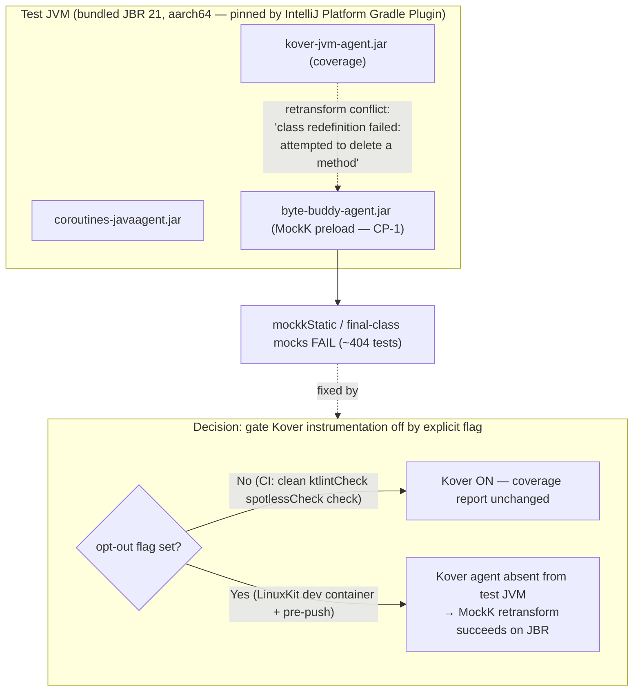

# Architecture Decisions

## Resolve Kover↔MockK java-agent conflict (keep tests on JBR) for the Linux-ARM dev container

- **Ticket:** container-mockk-bytebuddy-agent
- **Date:** 2026-06-29
- **Status:** Accepted

**Decision.** Keep the Gradle `test` task on the IntelliJ-Platform-mandated bundled JBR and make MockK-based tests pass in the Docker Desktop (LinuxKit, Linux-ARM) dev container by **removing the Kover coverage java-agent from the test JVM only where it conflicts**, via an explicit, default-off opt-out flag in the existing `kover { }` block of `build.gradle.kts`. The proven root cause is not the JVM and not the byte-buddy version: the test JVM runs three java-agents, and the Kover coverage agent conflicts with MockK's ByteBuddy inline instrumentation, producing `UnsupportedOperationException: class redefinition failed: attempted to delete a method` on `mockkStatic` / final-class retransforms. Disabling Kover instrumentation (nothing else) took `UtilsKtTest` from 12/16 failing to 1/16 (the one being an ordinary `AssertionFailedError`, no instrumentation error) and made `IgnoreServiceTest` (a `mockkStatic` user) build successfully — all on the same JBR. The runtime-switch alternatives (run on Corretto/Temurin; split JCEF vs non-JCEF test tasks; pick a newer JBR; OS/arch-conditional JVM) were rejected: the IntelliJ Platform Gradle Plugin 2.5.0 resolves the test runtime through `JavaRuntimePathResolver`, which always selects the bundled JBR and only honours a Java Toolchain whose vendor is "JetBrains", so a Corretto `javaLauncher` override is silently ignored (verified — the launcher resolved back to `JetBrains s.r.o.`); and the failure is the agent conflict, not the runtime, so no JVM change can fix it. The byte-buddy `resolutionStrategy.force("1.14.17")` currently on the branch is not load-bearing (the failure persisted with it applied) and its correctness is left for the coder to re-verify once Kover is out of the test JVM. CI safety is structural: the opt-out defaults to off, CI never sets the flag, so CI's agent set, coverage (`onCheck = true`), and test outcomes on ubuntu/macos/windows are byte-for-byte unchanged; only the opting-in LinuxKit container diverges, mirroring the existing local/CI asymmetry rather than adding a new one. The disproven dead ends remain forbidden (`jdk.attach.*`, `StartAttachListener`, `SYS_PTRACE`, `java.io.tmpdir` changes, switching the test runtime off JBR). Full record: brain ADR-1 (`adr-1-kover-mockk-agent-conflict.md`).
